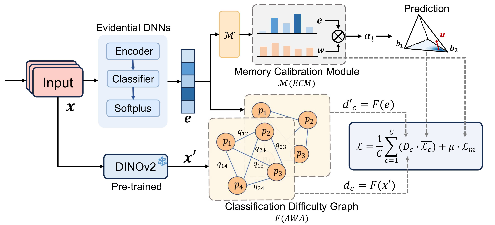

# Dynamic Evidence Adjustment (DEA)
## Introduction
Dynamic Evidence Adjustment (DEA) is proposed to address the uncertainty quantification issue of Evidential Deep Learning (EDL) on imbalanced datasets. EDL is a widely used paradigm for uncertainty quantification with minimal computational overhead, but it performs poorly on imbalanced data, where minority classes (with fewer samples) suffer from unstable optimization and abnormally high uncertainty even for correctly classified samples, leading to the Reliable Uncertainty Quantification for Imbalanced Data (RUQID) problem.

To solve this problem, DEA integrates two key components: the Adaptive Weight Adjustment (AWA) module dynamically balances the model’s optimization across classes by capturing data-based and evidence-based biases, while the Evidence-guided Memory Calibration Module (ECM) maintains class-specific evidence distributions to calibrate uncertainty, ensuring reliable results for all classes especially minorities. The schematic diagram of the core process of the project is as follows:



## Dataset
The following six real-world datasets were used to construct imbalanced data in the experiment:

### Data Source
1. [MNIST](https://pytorch.org/vision/stable/generated/torchvision.datasets.MNIST.html): 
2. [Fashion-MNIST](https://pytorch.org/vision/stable/generated/torchvision.datasets.FashionMNIST.html): 
3. [CIFAR-10](https://pytorch.org/vision/stable/generated/torchvision.datasets.CIFAR10.html): 
4. [SPOTS-10](https://github.com/Amotica/SPOTS-10):
5. [Caltech-101](https://data.caltech.edu/records/mzrjq-6wc02):
6. [Caltech-256](https://data.caltech.edu/records/nyy15-4j048):

### Data References
[1] LeCun, Y., Bottou, L., Bengio, Y., & Haffner, P. (1998). Gradient-based learning applied to document recognition.
[2] Xiao, H., Rasul, K., & Vollgraf, R. (2017). Fashion-MNIST: a novel image dataset for benchmarking machine learning algorithms.
[3] Krizhevsky, A., & Hinton, G. (2009). Learning multiple layers of features from tiny images.
[4] Atanbori, J. (2024). SPOTS-10: Animal Pattern Benchmark Dataset for Machine Learning Algorithms.
[5] Fei-Fei, L., Fergus, R., & Perona, P. (2004, June). Learning generative visual models from few training examples: An incremental bayesian approach tested on 101 object categories.
[6] Griffin, G., Holub, A., & Perona, P. (2007). Caltech-256 object category dataset.

## Project Structure
The following is a description of the core directory of the GitHub project. All directories and files are classified by function for easy reference and maintenance:
```bash
EDA/                     # Project root directory
├── data/                # Dataset directory (stores raw data and processed data)
│   ├── raw/             # Raw dataset (put here after downloading from the source link)
│   └── processed/       # Processed data (cleaned and preprocessed dataset for analysis)
├── images/              # Image storage directory (Key point: put sample images here)
│   └── eda_flow.png     # Sample image (project core process diagram, can be replaced with your model image)
├── src/                 # Core code directory
│   ├── data_loader.py   # Data loading script (reads raw data in the data/raw directory)
│   ├── data_preprocess.py # Data preprocessing script (implements cleaning, encoding, standardization and other operations)
│   ├── eda_analysis.py  # EDA analysis script (statistical analysis, feature correlation analysis)
│   └── visualization.py # Visualization script (generates charts and saves them to the images directory)
├── requirements.txt     # Dependent library list (Python libraries required by the project and their corresponding versions)
└── README.md            # Project description document (current document)
```

